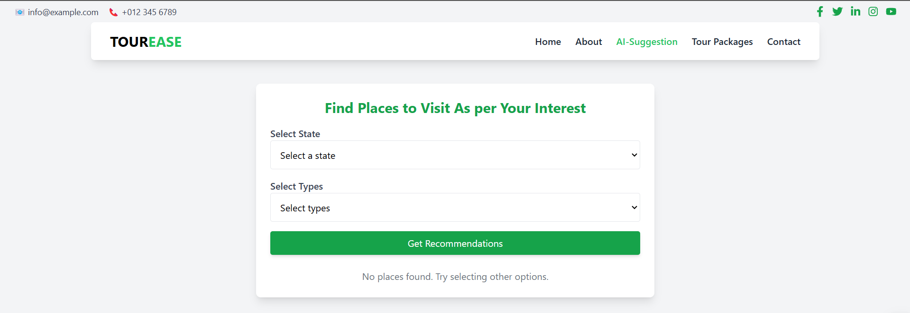
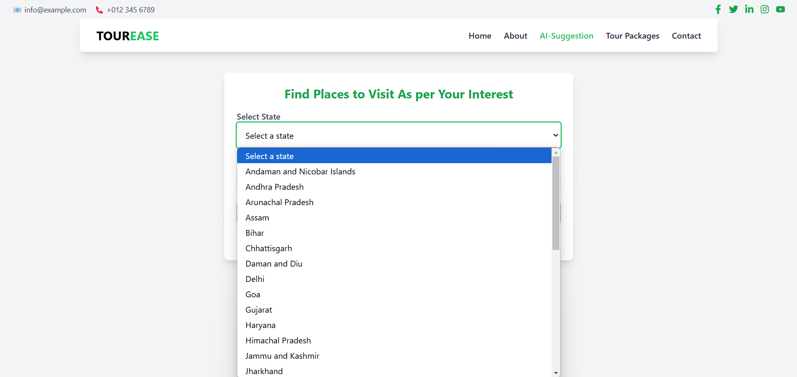
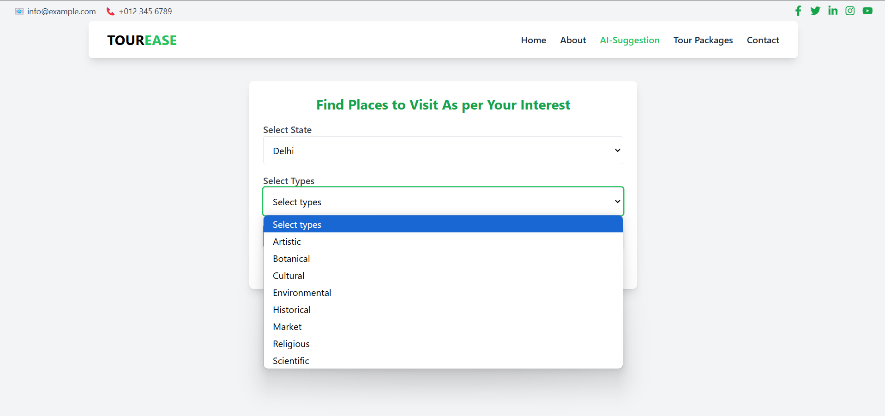
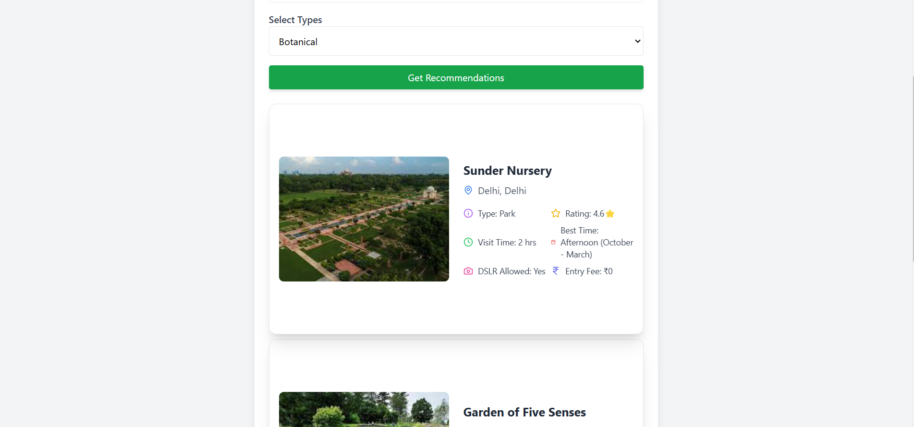

Here’s your `README.md` file:  

---

# Tour Recommendation System  

[Live Demo](https://tour-recommendation-nu.vercel.app/)  

## Overview  

Tour Recommendation System is a web-based application that helps users find the best places to visit based on their preferences, such as travel month, significance, and destination type. The system uses machine learning techniques to suggest top travel destinations.  

## Features  

- **Destination Recommendations**: Get suggestions for the best places based on filters.  
- **State & Activity Search**: Find places by state and activity type.  
- **User-Friendly Interface**: Clean and responsive UI for seamless navigation.  
- **Machine Learning Model**: Uses TF-IDF and cosine similarity for recommendations.  

## Project Screenshot  








## Installation  

### Frontend  

1. Download the project:  
   ```bash
   git clone https://github.com/your-repo/tour-recommendation.git
   ```  
2. Navigate to the frontend directory:  
   ```bash
   cd tourGuide
   ```  
3. Install dependencies:  
   ```bash
   npm i
   ```  
4. Run the development server:  
   ```bash
   npm run dev
   ```  

### Backend  

1. Navigate to the backend directory:  
   ```bash
   cd backend
   ```  
2. Install dependencies:  
   ```bash
   pip install -r requirements.txt
   ```  
3. Run the backend server:  
   ```bash
   python app.py
   ```  

---
